# Text-to-SQL Conversation Flow Documentation

This document describes the complete flow of how conversations work in the Text-to-SQL AI Chat System, from user input to AI response, including all the decision points and processing steps.

## High-Level Flow Chart

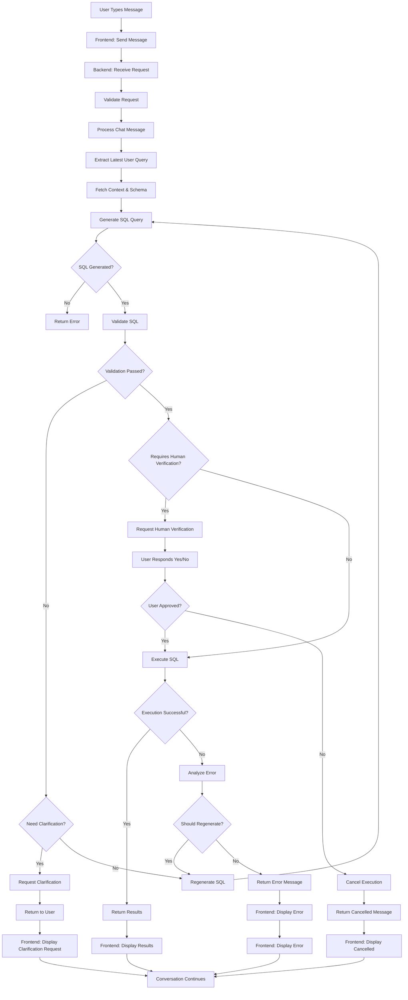

## Combined Detailed Flow Chart

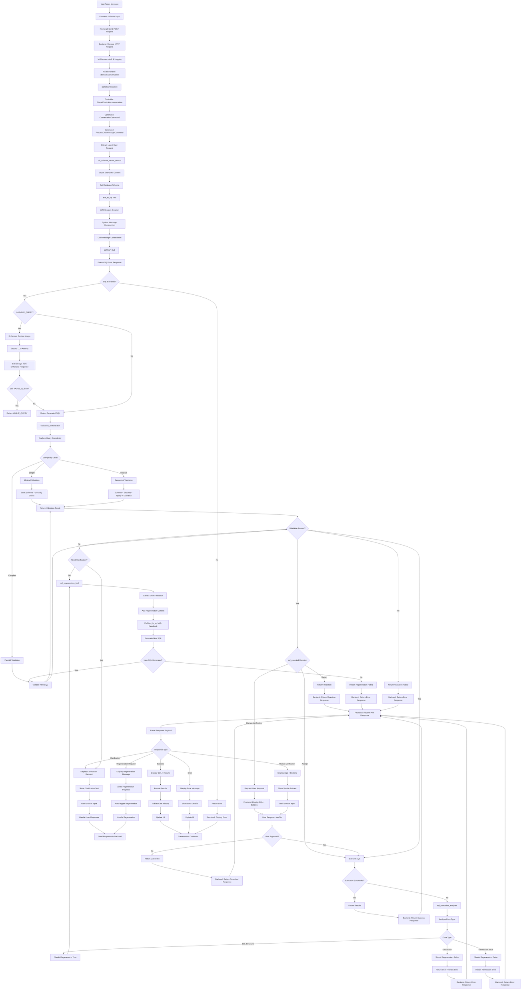

## Detailed Flow Breakdown

### 1. Frontend User Interaction

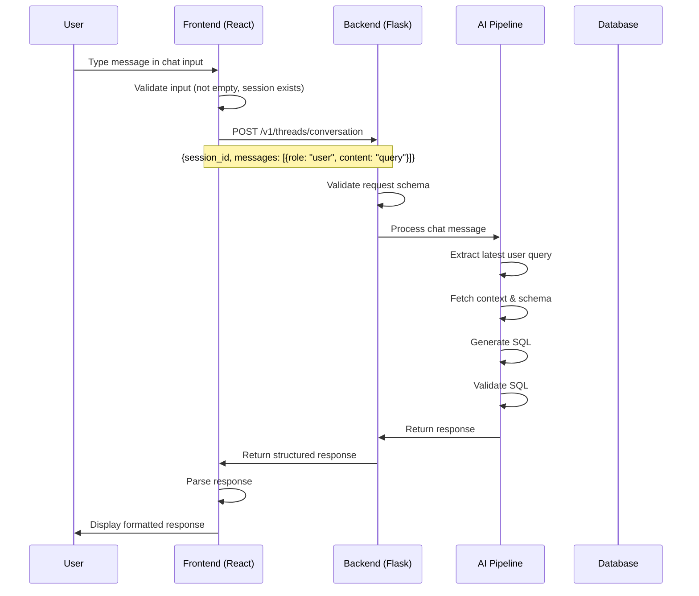

### 2. Backend Request Processing

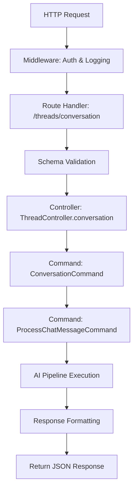

### 3. AI Pipeline Detailed Flow

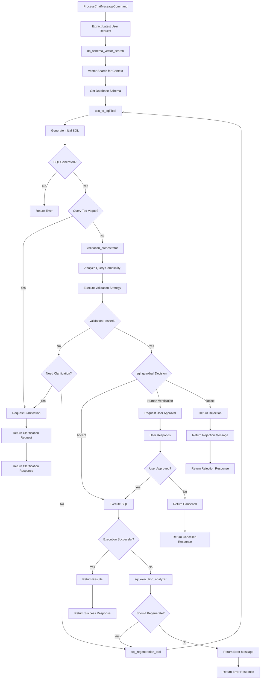

### 4. SQL Generation Process

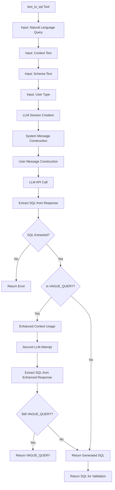

### 5. Validation Orchestration

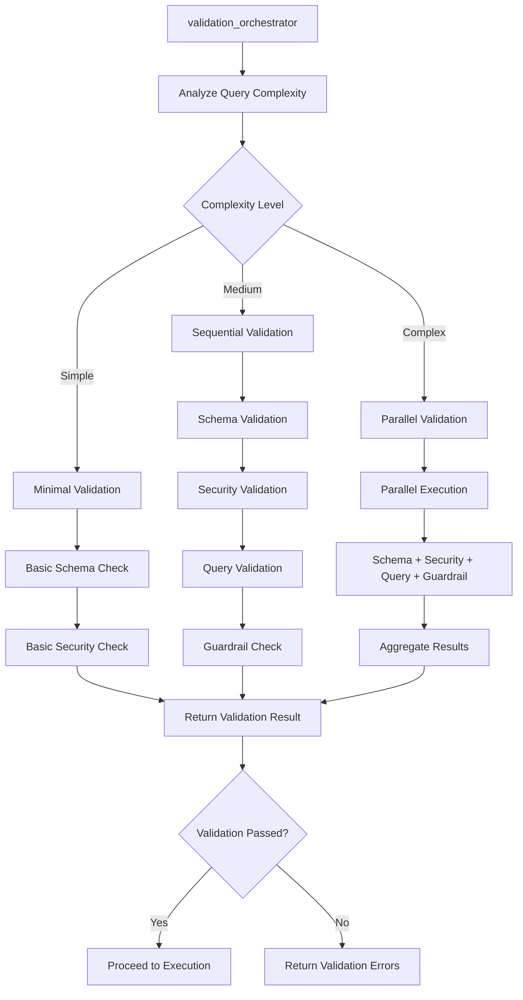

### 6. Human Verification Flow

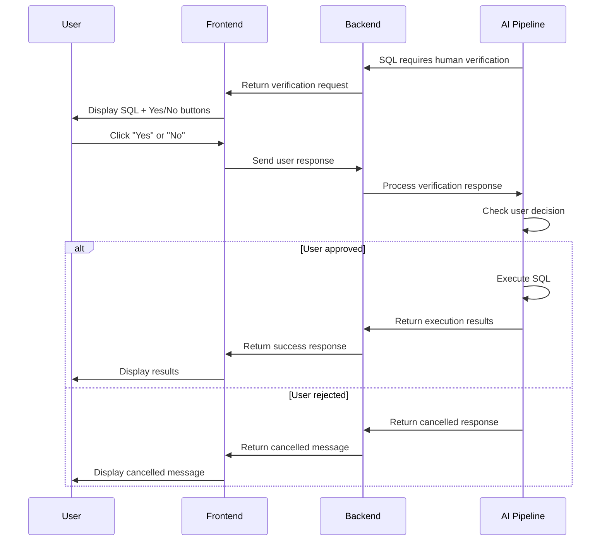

### 7. SQL Regeneration Flow

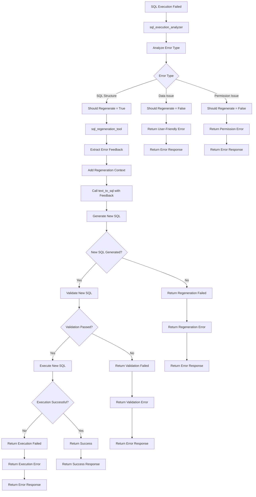

### 8. Frontend Response Handling

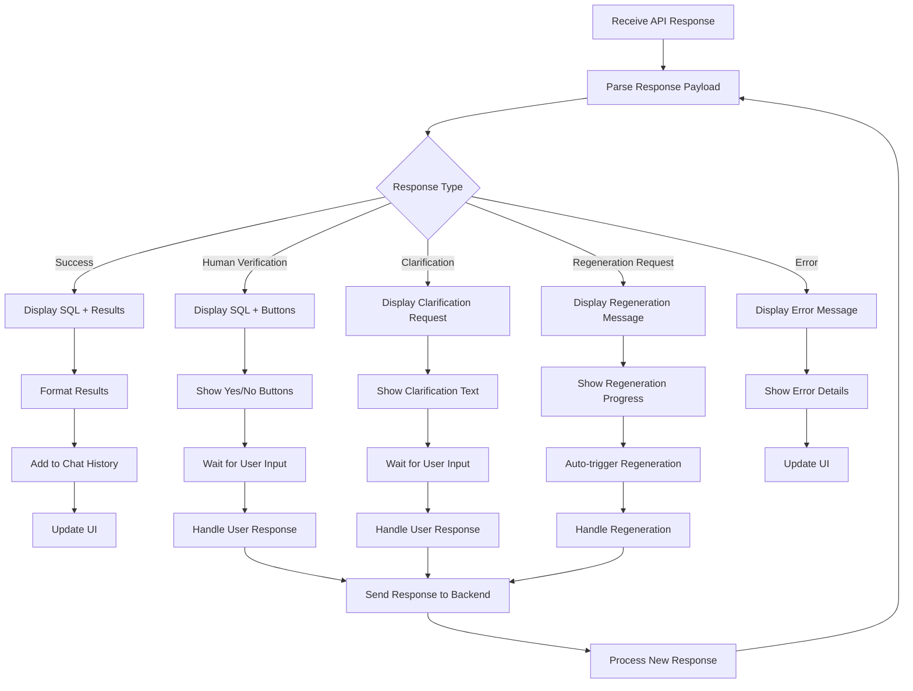

## Key Decision Points

### 1. SQL Generation Decisions
- **Vague Query Detection**: If the query lacks sufficient detail
- **Context Usage**: How aggressively to use available context
- **Schema Matching**: How to match user intent to database schema

### 2. Validation Decisions
- **Complexity Analysis**: Determines validation strategy
- **Security Assessment**: Checks for SQL injection and dangerous operations
- **Schema Compliance**: Validates against actual database schema
- **Permission Check**: Verifies user has appropriate permissions

### 3. Execution Decisions
- **Human Verification**: Required for destructive operations
- **Auto-execution**: Safe queries execute automatically
- **Error Handling**: How to respond to execution failures

### 4. Regeneration Decisions
- **Error Analysis**: Determines if regeneration is appropriate
- **Feedback Integration**: How to use error information
- **Retry Limits**: Prevents infinite regeneration loops

## Error Handling Flow

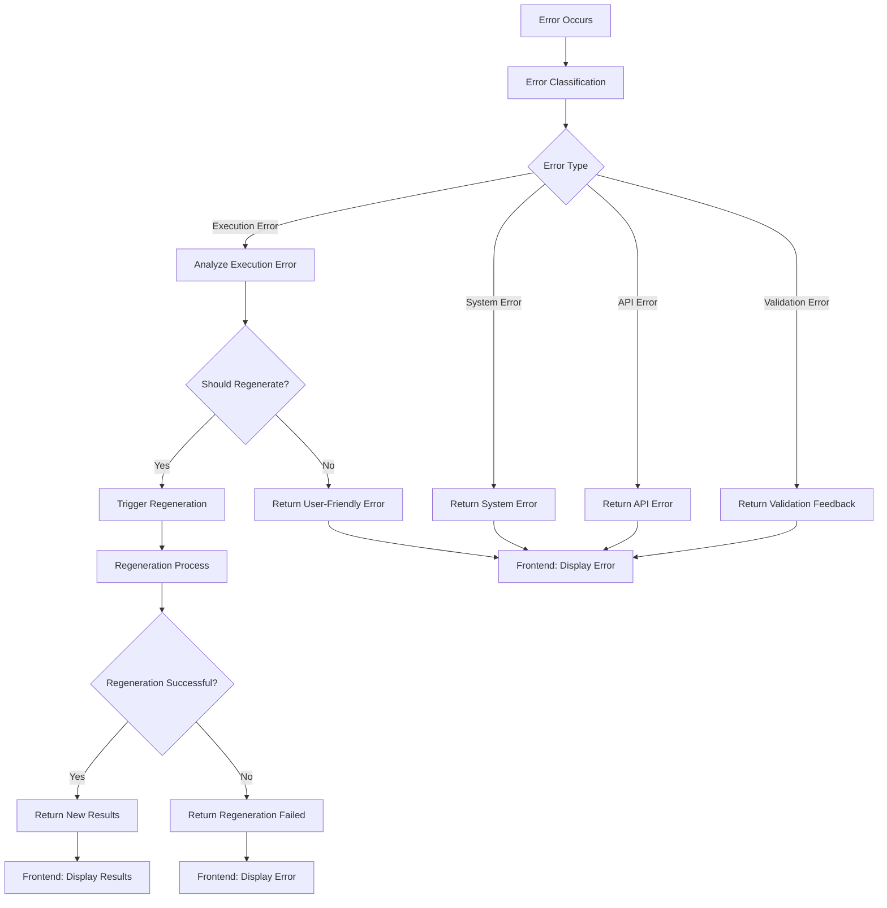

## Performance Considerations

### 1. Parallel Processing
- **Validation Orchestration**: Complex queries use parallel validation
- **Vector Search**: Concurrent context retrieval
- **Database Operations**: Async execution where possible

### 2. Caching Strategy
- **Schema Caching**: Database schema cached for performance
- **Context Caching**: Vector search results cached
- **Session State**: Conversation context maintained

### 3. Rate Limiting
- **API Calls**: OpenAI API rate limiting
- **Database Queries**: Query execution limits
- **User Sessions**: Session-based rate limiting

## Security Considerations

### 1. Input Validation
- **SQL Injection Prevention**: Multiple validation layers
- **Schema Validation**: Ensures queries match actual schema
- **Permission Checks**: User type-based access control

### 2. Output Sanitization
- **Result Filtering**: Sensitive data filtering
- **Error Message Sanitization**: Prevents information leakage
- **Response Validation**: Ensures safe response format

### 3. Access Control
- **User Type Validation**: Admin vs User permissions
- **Session Management**: Secure session handling
- **API Authentication**: Request authentication middleware

## Monitoring and Observability

### 1. Langfuse Integration
- **Trace Logging**: Complete conversation traces
- **Performance Metrics**: Response time tracking
- **Error Tracking**: Detailed error logging

### 2. Application Logging
- **Request Logging**: All API requests logged
- **Error Logging**: Detailed error information
- **Performance Logging**: Response time metrics

### 3. Metrics Collection
- **Validation Metrics**: Success/failure rates
- **Execution Metrics**: Query performance
- **User Metrics**: Session and usage statistics

---

This flow documentation provides a comprehensive view of how the Text-to-SQL conversation system works, from initial user input through all the AI processing steps to final response delivery. Understanding this flow is essential for debugging, optimization, and extending the system.
